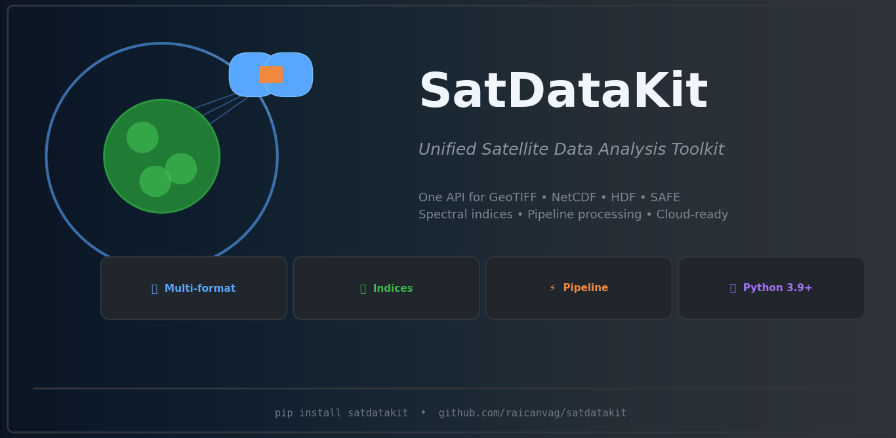

<p align="center">
  
</p>

<h1 align="center">SatDataKit</h1>

<p align="center">
  <strong>Unified satellite data analysis toolkit — one API for all Earth Observation formats.</strong>
</p>

<p align="center">
  <a href="https://github.com/raicanvag/satdatakit/blob/main/LICENSE">
    
  </a>
  
  
</p>

<p align="center">
  
</p>

<h1 align="center">SatDataKit</h1>

<p align="center">
  <strong>Unified satellite data analysis toolkit — one API for all Earth Observation formats.</strong>
</p>

<p align="center">
  <a href="https://github.com/raicanvag/satdatakit/blob/main/LICENSE">
    
  </a>
  
  
</p>

---

## What is SatDataKit?

SatDataKit solves a real problem in the Earth Observation community: **every satellite data format has its own API**, forcing scientists to learn GDAL, NetCDF4, h5py, rasterio, and Sentinel-specific tools just to read a single image.

SatDataKit **unifies all of that into one clean API**:

| Format | Library needed without SatDataKit | With SatDataKit |
|---|---|---|
| GeoTIFF | `rasterio` + coordinate handling | `read("file.tif")` |
| NetCDF | `xarray` + `netCDF4` + CF conventions | `read("file.nc")` |
| HDF5 | `h5py` + dataset discovery logic | `read("file.h5")` |
| Sentinel SAFE | `zipfile` + XML parsing + JP2 reader | `read("file.SAFE")` |

**Built on the same stack NASA uses** (xarray, rioxarray, rasterio, netCDF4, h5py) but with a unified abstraction layer that eliminates boilerplate.

# SatDataKit

**Unified satellite data analysis toolkit - one API for all Earth Observation formats.**

**Author:** DA Rafael Cañete Vazquez  
**License:** MIT

## Quick Start

```python
from satdatakit import read, compute_index, Pipeline

# Read any format
ds = read("sentinel2.tif")

# Compute indices
ds = compute_index(ds, "NDVI")

# Pipeline
result = (
    Pipeline()
    .read("data.tif")
    .reproject("EPSG:4326")
    .resample(30)
    .compute_index("NDVI")
    .to_geotiff("output.tif")

**Installation**

# Docker (recommended)
docker-compose up --build satdatakit

# Or Conda
conda env create -f environment.yml
conda activate satdatakit
pip install -e ".[dev]"


**Features**

Unified API: One read() for GeoTIFF, NetCDF, HDF, SAFE
Spectral Indices: NDVI, NDWI, EVI, SAVI, and more
Pipeline API: Fluent, chainable operations
Time Series: Stack multiple scenes automatically